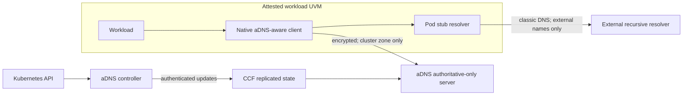

# micro aDNS for Virtual Node 2 confidential workloads

## Scope

This document proposes aDNS for Kubernetes service discovery in Virtual Node 2
on Azure Kubernetes Service (AKS) with Confidential Azure Container Instances
(ACI). It is a design proposal, not a description of the current aDNS
implementation.

In this document, every Pod is scheduled to Virtual Node 2 and runs in
Confidential ACI. Each Pod maps to one ACI container group. That container
group runs in its own Hyper-V-isolated utility virtual machine (UVM). A Virtual
Node 2 Kubernetes Node object is only a scheduling target. It is not a shared
UVM.

> **The base design serves exactly one DNS zone:** the Kubernetes cluster
> domain, such as `cluster.local.`. Kubernetes namespaces are names in this
> zone. They are not separate zones.

The base design does not perform recursion, delegate child zones, or use
DNSSEC. The separate
[efficient delegation proposal](./efficient_delegation_aDNS.md) describes a
possible multi-zone extension.

## Rationale

DNSSEC provides data-origin authentication independently of the transport. It
does not provide confidentiality. It also adds signatures, DNSSEC records,
larger answers, key rollover, and validation logic.

The target environment has one operator, one cluster zone, and attested
workload UVMs. A workload can connect directly to aDNS through an authenticated
and encrypted channel. This makes transport security a simpler trust model for
cluster service discovery. It also avoids DNSSEC-specific client configuration,
which makes initial adoption and protocol changes faster.

The design provides:

- confidential DNS queries and answers in transit;
- no DNSSEC signing or validation on the cluster path;
- immediate publication of committed Kubernetes updates; and
- post-quantum migration through the TLS or QUIC stack, without a signature on
  each RRset.

This is a deliberate change of trust model. Transport security protects a live
exchange with aDNS. It does not create a portable proof for a DNS answer.

## Architecture

The terms follow [RFC 9499](https://www.rfc-editor.org/rfc/rfc9499.html#section-6):

- The **Pod stub resolver** uses `/etc/resolv.conf` for external names.
- The **native aDNS-aware client** routes cluster-zone queries directly to
  aDNS.
- The private **aDNS authoritative-only server** answers only for the cluster
  zone. It never forwards or recurses.
- An **external recursive resolver** resolves names outside the cluster zone.

### Control plane

An aDNS controller watches Kubernetes Services and EndpointSlices. It can also
watch Pods when the selected DNS schema needs Pod records. It converts the
observed state into one atomic zone generation.

CCF stores and replicates the zone. The DNS endpoint serves only a globally
committed generation. It does not serve ordinary current KV state, because an
election can roll back state that is not globally committed.

The update API authenticates the controller and limits writes to the configured
origin. CCF governance controls the origin, controller credentials, and trust
roots.

### DNS data and responses

The zone contains one SOA RR, an authoritative NS RRset, and the selected
Kubernetes service-discovery records. These can include:

- `A` and `AAAA` records for normal and headless Services;
- `SRV` records for named ports;
- `CNAME` records for ExternalName Services; and
- endpoint and Pod records required by the selected schema.

For a headless Service, every SRV target has a matching address record. The
controller derives a stable endpoint label when Kubernetes supplies no
hostname.

Confidential ACI does not run kube-proxy. A normal Service ClusterIP can
therefore be unreachable from a workload UVM. micro aDNS does not provide
Service routing.

Before aDNS publishes a normal Service record, the deployment verifies that
the ClusterIP is reachable from every admitted workload reachability class. A
class defines a uniform subnet, address family, and network policy. If one
class cannot reach an address, aDNS omits that RRset globally. It never
substitutes endpoint addresses at a normal Service owner name.

A deployment that omits required Kubernetes records uses its own DNS-schema
identifier. It does not claim full conformance with the Kubernetes DNS-Based
Service Discovery specification.

Clients send direct queries with `RD=0`. aDNS sets `RA=0`. It sets `AA=1` for
in-zone answers. NODATA and NXDOMAIN responses include the zone SOA. Their
negative TTL is bounded by the smaller of the SOA TTL and SOA.MINIMUM. aDNS
returns REFUSED with `AA=0` for every out-of-zone query.

### Native name routing

The native client applies the Pod search list and `ndots` rules once. It builds
an ordered list of absolute candidate names. It compares complete DNS labels
case-insensitively. The cluster origin itself and all its subdomains are
in-zone.

The client sends each in-zone candidate only to aDNS. It sends only absolute,
out-of-zone candidates to the Pod stub resolver.

Only an authenticated NXDOMAIN can advance the search sequence. An
authenticated NODATA ends the lookup for that type. Every other in-zone
outcome, including a timeout or malformed response, aborts the complete logical
lookup without fallback.

The client follows CNAME chains one hop at a time and classifies every target.
It rejects loops and applies a hop limit. If an external answer points back into
the cluster zone, the client rejects its in-zone RRsets and queries aDNS for the
target. Data from an external target is external data, even when an
authenticated in-zone CNAME points to it.

## Secure transport and identity

DoH is the initial transport because aDNS already uses the CCF HTTPS stack.
Direct DoT is a deployment-specific client-to-authoritative option that reuses
RFC 7858 framing and TLS requirements. DoQ or DoH over HTTP/3 can be added
later.

All transport options require:

- strict aDNS server authentication;
- no classic-DNS fallback for an in-zone name;
- connection reuse and bounded resource use;
- non-recursive queries with `RD=0`; and
- DNS padding where traffic analysis is in scope.

The direct client-to-authoritative use is a deployment-specific profile. It
does not claim interoperability with a general recursive DNS service.

### Two attestation decisions

Workload trust and aDNS authentication are separate decisions.

1. An external workload provisioner verifies the workload UVM evidence and the
  confidential computing enforcement-policy digest. The fresh evidence binds
  a workload-generated public key. The provisioner releases the aDNS address,
  trust policy, and any workload credential only through a channel
  authenticated to that key.
2. The native client verifies the aDNS service evidence and binds it to the
   certificate or SubjectPublicKeyInfo (SPKI) selected by TLS.

Current CCF attestation binds a node identity. This design depends on the
service-identity model proposed in the
[CCF post-quantum identity discussion](https://github.com/microsoft/CCF/discussions/7971#attestation).
The typed evidence must identify a service-scoped, user-facing TLS identity and
must bind the exact certificate or SPKI.

The enlightened bootstrap is transport-neutral. The client obtains the
candidate identity and evidence through an untrusted bootstrap exchange or a
provisioned bundle, without sending a DNS query. It verifies the evidence and
identity binding, then opens or reopens the selected DoH, DoT, or DoQ channel.

The relying-party policy checks the hardware endorsement chain, processor and
TCB, UVM endorsements, measurement, and enforcement-policy digest. The client
also needs a freshness mechanism. This can be challenge-bound evidence or a
trusted signed validity and revocation mechanism. Session tickets cannot outlive
the accepted certificate or evidence validity.

The first DoH implementation can instead use a provisioned certificate
authority or certificate pin. Attested service-identity bootstrap can replace
that provisioning when CCF exposes the required evidence and freshness model.

If aDNS authorizes workloads, the provisioner binds a workload credential to
the verified workload evidence and aDNS requires that credential through mutual
TLS. Otherwise, aDNS performs server authentication only.

## Virtual Node 2 DNS behavior

Virtual Node 2 normally writes the Pod sandbox DNS configuration to
`/etc/resolv.conf`. It does not inject a recursive resolver process. It also
adds Azure DNS at `168.63.129.16` when that address is absent.

The Virtual Node 2 DNS-injection opt-out selects ACI DNS configuration. It does
not provide secure cluster DNS.

The base design bypasses this configuration for in-zone names. The native
aDNS-aware client uses a preconfigured, UVM-reachable private aDNS address. A
Service ClusterIP is unsuitable unless every admitted workload class can reach
it. The client continues to use the Pod stub resolver only for external names.

### Optional compatibility mode

A workload that cannot use a native client can run one recursive resolver in
its UVM. The resolver can be an explicit sidecar or a VirtualDaemonSet
companion. The enforcement policy must authorize it.

This mode is valid only when the local resolver is the sole usable destination
for Pod stub queries. `/etc/resolv.conf` cannot route names by zone, and listing
the local resolver first is not sufficient.

The deployment must:

- configure the Pod stub resolver to use the UVM-local resolver;
- block Azure DNS with an outbound `AzurePlatformDNS` network security group
  rule;
- block UDP and TCP port 53 to every other unapproved destination; and
- send cluster-zone queries from the local resolver only to aDNS over the
  authenticated transport.

If these controls cannot be enforced and tested, the deployment must use the
native client mode.

## Post-quantum readiness

The transport can adopt a hybrid or post-quantum key exchange, such as ML-KEM.
It can also adopt post-quantum certificate and handshake signatures, such as
ML-DSA. Persistent connections amortize their larger setup messages across many
queries.

This gives transport-level post-quantum readiness without changing DNS records
or signing every RRset. End-to-end post-quantum readiness applies only when
every authentication and integrity dependency in workload provisioning and
zone publication is post-quantum or hybrid.

## Deployment checks

Before deployment, verify that:

- each published address is reachable from every admitted workload class;
- an admission or network change cannot invalidate reachability before affected
  normal-Service and headless address records are atomically withdrawn;
- search-list, `ndots`, NXDOMAIN, NODATA, and cross-zone CNAME behavior is
  correct;
- an in-zone timeout, authentication failure, or SERVFAIL fails closed;
- no in-zone query reaches Kubernetes DNS, Azure DNS, or an external resolver;
- a CCF election never exposes a pending or mixed zone generation;
- stale or incorrectly scoped attestation evidence is rejected; and
- certificate rotation and session resumption respect the evidence lifetime.

The deployment also defines and tests a propagation-time objective under
healthy Kubernetes watch and CCF consensus conditions.

## References

- [Kubernetes DNS-Based Service Discovery](https://github.com/kubernetes/dns/blob/master/docs/specification.md)
- [Virtual nodes on Azure Container Instances](https://learn.microsoft.com/en-us/azure/container-instances/container-instances-virtual-nodes)
- [Confidential containers on Azure Container Instances](https://learn.microsoft.com/en-us/azure/container-instances/container-instances-confidential-overview)
- [Virtual Node 2 Pod customizations](https://github.com/microsoft/virtualnodesOnAzureContainerInstances/blob/main/Docs/PodCustomizations.md)
- [Virtual Node 2 VirtualDaemonSets](https://github.com/microsoft/virtualnodesOnAzureContainerInstances/blob/main/Docs/VirtualDaemonSets.md)
- [Configure custom DNS in Azure Container Instances](https://learn.microsoft.com/en-us/azure/container-instances/container-instances-custom-dns)
- [Azure platform DNS blocking](https://learn.microsoft.com/en-us/azure/virtual-network/what-is-ip-address-168-63-129-16)
- [RFC 9499: DNS Terminology](https://www.rfc-editor.org/rfc/rfc9499.html)
- [RFC 7858: DNS over TLS](https://www.rfc-editor.org/rfc/rfc7858.html)
- [RFC 8484: DNS over HTTPS](https://www.rfc-editor.org/rfc/rfc8484.html)
- [RFC 9250: DNS over QUIC](https://www.rfc-editor.org/rfc/rfc9250.html)
- [CCF post-quantum identity proposal](https://github.com/microsoft/CCF/discussions/7971)
- [NIST FIPS 203: ML-KEM](https://csrc.nist.gov/pubs/fips/203/final)
- [NIST FIPS 204: ML-DSA](https://csrc.nist.gov/pubs/fips/204/final)
