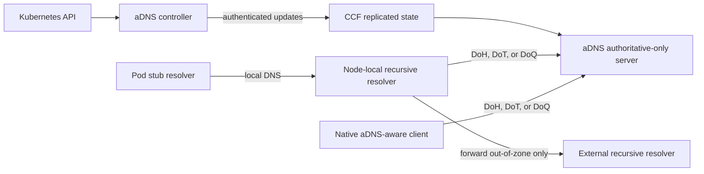

# micro aDNS: a single-zone cluster DNS service for Kubernetes

## Status and scope

This document proposes a variant of aDNS for Kubernetes service discovery. It
is a design note, not a description of the current aDNS implementation.

> **The base design serves exactly one DNS zone.** This zone is the Kubernetes
> cluster domain, such as `cluster.local.`. Kubernetes namespaces, such as
> `default.svc.cluster.local.`, are names in this zone. They are not separate
> zones. The base design does not use child-zone delegation, a DNSSEC trust
> chain, or multi-zone administration.

## Terminology

This proposal follows the current definitions in
[RFC 9499, Section 6](https://www.rfc-editor.org/rfc/rfc9499.html#section-6).
RFC 9499 uses the original resolver definition from
[RFC 1034, Section 2.4](https://www.rfc-editor.org/rfc/rfc1034.html#section-2.4).

- A **Pod stub resolver** sends recursive queries (`RD=1`) to the node-local
  recursive resolver. It cannot complete all resolution itself.
- The **node-local recursive resolver** accepts Pod recursive queries and
  caches responses. It sends cluster-zone queries directly to aDNS. For other
  names, it performs forwarding or returns REFUSED.
- The private **aDNS authoritative-only server** answers only for the cluster
  zone from committed CCF state. It never performs forwarding or recursion.
- An **external recursive resolver** resolves names outside the cluster zone.

The term **cluster DNS service** means the complete deployment. It includes
the node-local recursive resolvers and the shared aDNS authoritative-only
server.

Each Pod uses a stub resolver. The stub sends recursive queries to a node-local
recursive resolver. That resolver sends cluster-zone queries directly to aDNS.
aDNS is authoritative for Service and Pod records in the configured cluster
domain. For a name outside that domain, the node-local resolver forwards the
query to an external recursive resolver or refuses the query. This action does
not add the external DNS name or zone to the aDNS-managed cluster zone.

The node-local recursive resolver and each native aDNS-aware client MUST
authenticate the aDNS endpoint. Neither component may fall back to cleartext
DNS for names in the cluster zone. The classic DNS path from a Pod stub
resolver to the node-local recursive resolver remains inside the node.

The deployment serves one Kubernetes cluster and one trust domain. It is not a
public DNS service. aDNS is a private authoritative-only server. It does not
provide recursive service. The aDNS authoritative-only server is cluster-wide.
It is not a separate authoritative server on each node. All node-local
recursive resolvers connect to one logical aDNS authoritative-only server. CCF
replicates this server, which can expose multiple endpoints for availability.
Native aDNS-aware clients can connect to these endpoints directly.

The proposal replaces DNSSEC on the client-to-aDNS path with an authenticated,
encrypted transport:

- DNS over HTTPS (DoH) as the initial profile;
- DNS over TLS (DoT) as a lean DNS-native alternative; and
- DNS over QUIC (DoQ), or DoH over HTTP/3, as a later option.

The client MUST authenticate the aDNS endpoint and MUST NOT silently fall back
to cleartext DNS for names in the cluster zone. This is a strict encrypted-DNS
profile, not opportunistic encryption.

## Motivation

DNSSEC provides data-origin authentication and data integrity independently of
the transport. Public DNS needs this protection because responses cross
administrative boundaries and untrusted recursive caches. DNSSEC also has
costs:

- DNSSEC signs each authoritative RRset and adds an RRSIG;
- negative answers include signed NSEC or NSEC3 data;
- clients and servers implement DNSSEC-specific algorithms, canonicalization,
  validation, rollover, and failure handling;
- DNSSEC must frequently sign records that change; and
- larger answers increase bandwidth and, over UDP, the likelihood of
  truncation, fragmentation, or TCP fallback.

These tradeoffs are less useful in the proposed Kubernetes environment. This
environment has one operator and one service-discovery zone. It also gives the
node-local recursive resolver a direct, authenticated connection to aDNS. The
cluster trusts aDNS to apply cluster policy. It also trusts aDNS to return
correct authoritative data for the cluster zone. A strict DoH, DoT, or DoQ
connection authenticates aDNS and protects each exchange. It also keeps
queries and responses confidential in transit.

Removing DNSSEC from this constrained path has several practical benefits:

- **Simpler adoption.** Applications can use a native aDNS-aware client. Other
  applications use a node-local recursive resolver.
- **Faster iteration.** Service and EndpointSlice changes do not trigger RRset
  signatures or NSEC/NSEC3 maintenance.
- **Smaller answers.** Responses contain ordinary Kubernetes DNS records, not
  DNSKEY, DS, RRSIG, NSEC, or NSEC3 records.
- **Confidentiality.** DNSSEC deliberately does not hide query names or
  answers; TLS and QUIC do.
- **PQC agility.** Post-quantum protection can be introduced in the general
  TLS/QUIC stack without changing DNS records or adding a signature to each
  RRset.

This proposal deliberately changes the trust model. It does not claim that
encrypted DNS and DNSSEC are generally interchangeable. Transport security
protects two types of live exchange. One connects a node-local recursive
resolver to the aDNS authoritative-only server. The other connects a native
aDNS-aware client to that server. Transport security does not make an answer
independently verifiable outside its protected channel.

## Proposed architecture

Only the recursive resolver in this diagram is node-local. The shared aDNS
authoritative-only server is cluster-wide. Here, **node-local** describes only
the recursive resolver and its classic-DNS ingress. It does not describe aDNS
or its authoritative state.



### Control plane

A Kubernetes controller watches resources for Kubernetes service discovery.
It initially watches Services and EndpointSlices. It can also watch Pods. The
controller uses normal list-watch reconciliation. It relists resources when a
watch expires. It identifies each source object by kind, namespace, name, and
UID. It tracks resource versions separately for each resource kind. It does not
compare Service versions with EndpointSlice versions. The controller combines
each Service and its EndpointSlices into one atomic RRset update.

CCF stores the records in its replicated key-value state. CCF can expose state
before the related transaction is globally committed. An election can roll
back this state. Thus, the DNS path serves only a globally committed zone
generation. The DNS endpoint explicitly reads a globally committed view or an
immutable snapshot of that generation. It does not serve ordinary current KV
state. The controller keeps an update pending until its transaction status is
`Committed`. This polling supports reconciliation. It does not provide read
isolation. The controller reconciles the update again if the status becomes
`Invalid`. An idempotency key prevents a retry from creating a second logical
generation.

The update API does not accept requests from arbitrary Pods. It authenticates
the controller. It also applies a policy that limits writes to the configured
origin. CCF governance controls the aDNS configuration, controller
credentials, and trust-root changes.

### The single zone

The deployment has one `origin`, such as `cluster.local.`. The origin is
immutable or controlled by governance. It contains these records for
Kubernetes service discovery:

- `A` and `AAAA` records for normal and headless Services;
- `SRV` records for named Service ports;
- `CNAME` records for ExternalName Services; and
- the Kubernetes DNS schema-version `TXT` record for the implemented profile;
- optional Pod and hostname records where the cluster policy enables them.

The controller uses EndpointSlice readiness information. It honors the Service
`publishNotReadyAddresses` setting. It uses endpoint hostnames for headless
Services and SRV targets. It supports both address families in dual-stack
clusters.

The zone has one SOA and one default policy for TTL limits. Namespace labels do
not create zone cuts. The `svc` and `pod` branches also do not create zone
cuts. The aDNS server does not publish DNSKEY, DS, RRSIG, NSEC, or NSEC3
records. It does not use the AD bit to claim DNSSEC validation for this zone.

The Kubernetes DNS-Based Service Discovery specification also defines reverse
PTR records. These records use `in-addr.arpa.` and `ip6.arpa.`. They cannot
belong to the single `cluster.local.` zone. Thus, the base profile does not
claim full reverse-DNS conformance. An explicit policy tells the node-local
recursive resolver to forward or refuse these queries. Authoritative reverse
zones require the
[efficient delegation extension](./efficient_delegation_aDNS.md).

For a name below the configured origin, the aDNS authoritative-only server
reads committed CCF state. It returns an authoritative answer, NODATA, or
NXDOMAIN. It never performs recursion or forwarding.

For every query outside the configured origin, the aDNS authoritative-only
server returns REFUSED. For an out-of-zone Pod query, the node-local recursive
resolver applies one of two policies:

1. **Split forwarding:** the node-local recursive resolver forwards the query
  to an external recursive resolver, preferably over an encrypted transport.
  The external resolver's validation and trust policy is independent of the
  aDNS zone.
2. **Cluster-zone only:** the node-local recursive resolver returns REFUSED.
  Workloads use an external recursive resolver for public names.

This separation prevents a client from treating external data as protected
aDNS cluster-zone data.

### Query transports

DoH is the simplest first implementation because aDNS already uses the CCF
HTTPS stack. aDNS can expose an RFC 8484 endpoint, such as `/dns-query`. The
endpoint accepts the `application/dns-message` wire format. It returns standard
DNS messages. RFC 8484 requires the server to support GET and POST. Cluster
clients can prefer POST. The deployment disables shared HTTP caches and
cookies. A private client cache or node-local DNS cache remains useful.

DoT sends standard, two-byte length-prefixed DNS messages through a persistent
TLS connection. It avoids HTTP semantics. It requires a dedicated listener and
connection management.

DoQ maps each query to a QUIC stream. It avoids TCP head-of-line blocking. It
also recovers efficiently from packet loss. However, it adds a QUIC
implementation and a second transport to operate. The deployment adds DoQ only
after the DoH profile and trust bootstrap are stable. DoH over HTTP/3 can use
QUIC and keep the DoH API. A DoQ implementation follows RFC 9250, including
its mandatory padding behavior.

All profiles share these requirements:

- server authentication against a cluster-provisioned CA, certificate pin, or
  attested aDNS service identity;
- no cleartext downgrade for in-zone queries;
- connection reuse, multiplexing or pipelining, bounded idle time, and session
  resumption to amortize handshakes;
- bounded request size, rate, concurrency, and connection count; and
- DNS padding where traffic-analysis resistance is required.

The initial deployment disables TLS and QUIC early data. A later deployment can
enable it only for operations that the transport profile permits as
replayable. The threat model then treats early DNS queries as replayable.

Mutual TLS is optional. It can restrict access to cluster nodes or workloads.
It can also support identity-based policy. However, it makes queries easier to
link at the aDNS server. A node-local recursive resolver normally authenticates
as the node. A native aDNS-aware client can use a workload identity when policy
requires per-workload authorization.

### Native aDNS-aware clients and attested TLS bootstrap

A native aDNS-aware client can use DoT directly. It can also verify an aDNS
attestation bundle. Thus, it does not need the node-local recursive resolver.
It uses the classic aDNS relying-party model to bootstrap trust. It then uses
strict TLS authentication for DNS queries.

This design depends on the target CCF identity model described in the
[Attestation section of the CCF post-quantum identity
proposal](https://github.com/microsoft/CCF/discussions/7971#attestation). Current
CCF attestation binds a node identity. The proposed model can bind a service
identity instead. It records typed metadata with the digest. This metadata
specifies the attestation scope, identity type, material kind, purpose,
algorithm suite, and hash algorithm. micro aDNS assumes that CCF provides this
service-identity attestation. It does not define an interim node-to-service
receipt protocol.

The client is provisioned out of band with:

- one or more aDNS endpoint addresses and the expected single-zone origin;
- roots for verifying the hardware and UVM endorsement chains;
- a platform relying-party policy covering accepted processor products, TCB
  levels, UVM endorsement issuers, feeds, and security versions; and
- a service relying-party policy for the accepted aDNS UVM measurement and
  endorsement claims. This policy also specifies the accepted security-policy
  digest in the attestation report's `host_data`.

These policies are trust anchors. The untrusted endpoint can return policy
text. The client MUST NOT trust that text as a replacement policy.

The classic aDNS bootstrap verifies an attestation. It applies the platform and
service relying-party policies. It accepts identity material only when the
verified evidence binds that material. The TLS variant applies this logic to
the identity that the TLS handshake selects:

```text
verified hardware and UVM endorsements
  -> accepted platform and service relying-party policies
  -> typed service/UserTLS identity binding in report_data
  -> exact certificate or SPKI selected by the TLS handshake
```

The bootstrap proceeds as follows:

1. The client opens a provisional TLS connection to a configured IP address
   and records the certificate chain and leaf SPKI. The client can use this
   connection to retrieve the bootstrap bundle. It does not send DNS queries
   or use DNS answers. It does not yet treat the peer as authenticated.
2. The client verifies the SNP report and the AMD endorsement chain. It
   verifies the UVM endorsements. It checks that the UVM measurement matches
   the measurement in the SNP evidence.
3. The client evaluates its local relying-party policies against the verified
   claims. It evaluates both the platform policy and the service policy. A
   policy failure stops the bootstrap.
4. The client parses the typed `report_data` binding. It requires the scope to
   be `service`. It requires a purpose that authorizes user-facing TLS. The
   identity type, material kind, algorithm suite, and hash algorithm must
   satisfy local policy. The client rejects unknown layout versions and
   non-zero reserved bytes. It also rejects unsupported combinations and a
  node-scoped binding. For a SHA-256 binding, the client requires the unused
  final 16 bytes of the 48-byte digest slot to be zero.
5. The client follows the service TLS example in the CCF proposal. It hashes
   the canonical DER certificate that step 1 selected. It compares this hash
   with the digest in `report_data`. An SPKI profile hashes the identified DER
   SubjectPublicKeyInfo instead. The material kind distinguishes a certificate
   digest from a key digest.
6. The client checks the authenticated certificate against the configured aDNS
   authentication name. It also applies its freshness policy to the evidence.
7. The client closes the provisional connection and opens a fresh DoT
   connection. It validates this connection with the newly trusted certificate
   or SPKI. It sends DNS queries only after this handshake succeeds. A capable
   TLS library can safely promote a held connection instead. However, a new
   connection gives the implementation a clear trust boundary.
8. The client retrieves the service configuration through the authenticated
   connection. It compares the sole managed origin with its configured cluster
   origin. It enables resolution only when the origins are equal. The CCF
   attestation authenticates the TLS identity. It does not encode the DNS
   origin.

An active attacker can replay or replace the bundle on the provisional
connection. However, the attacker cannot bind the bundle to the attacker's TLS
key. The service attestation binds the accepted certificate or SPKI digest.
The new TLS handshake proves possession of the related private key. The client
still needs an explicit freshness policy. Without this policy, attestation
evidence is a replayable historical object.

After bootstrap, the client stores the accepted service identity and origin. It
also stores the validity limit and relying-party policy digest. Later DoT
connections use strict certificate or SPKI validation. They can reuse
connections and resume sessions. A resumption ticket MUST expire no later than
the certificate or accepted evidence. Rotation presents the old and new
identities during an overlap period. The client verifies each new identity
type before it trusts that identity. A client that misses the overlap repeats
the full bootstrap. An authentication failure fails closed for the cluster
zone. It never causes cleartext fallback.

The CCF proposal lets the service hold multiple TLS identities. These can
include classical and ML-DSA certificates. TLS selects an identity that the
client supports. The client verifies the typed attestation for the selected
identity. During migration, the service can offer classical and post-quantum
identities. A standard TLS connection authenticates only the selected identity.
Local policy can allow classical authentication or require post-quantum
authentication. A requirement for both needs a separate composite or
dual-authentication profile.

Each node-local recursive resolver can run this flow for legacy applications.
A workload with a native aDNS-aware client can run the flow itself. It then
gets a direct, authenticated, and confidential path to the shared aDNS
authoritative-only server.

## Kubernetes integration

Most libc stub resolvers and Kubernetes-generated `/etc/resolv.conf` files send
classic DNS over UDP or TCP. They cannot be assumed to speak DoH, DoT, or DoQ.
Thus, a DaemonSet deploys a node-local recursive resolver:

1. kubelet configures Pods with the recursive resolver's node-local address as
  their nameserver. It also configures the normal namespace and cluster-domain
  search list;
2. the recursive resolver accepts recursive DNS queries from local Pods;
3. it sends cluster-zone queries to the aDNS authoritative-only server over a
  pooled, authenticated, encrypted connection; and
4. it caches positive and negative responses within the specified limits. It
  forwards other queries to an external recursive resolver or returns REFUSED,
  as the deployment policy specifies.

The node-local recursive resolver caches positive RRsets for their remaining
TTL. It caches negative responses for at most
`min(SOA TTL, SOA.MINIMUM)`. For DoH, it subtracts the HTTP `Age`.

The initial recursive-resolver profile supports Linux nodes. It listens on a
node-local link-local or ULA address. CNI or packet-filter rules keep the
traffic on the node. A Pod has a separate network namespace. Thus, the Pod's
loopback address does not reach an ordinary DaemonSet. Loopback requires a
per-Pod sidecar or an explicit namespace arrangement. Windows needs a separate
profile because its stub-resolver and search-suffix behavior differs. If
classic DNS crosses the cluster network, the path is not confidential from the
Pod to aDNS. A native aDNS-aware client can connect directly to aDNS and avoid
this boundary.

The endpoint address, authentication name, and trust material must be
provisioned without using that endpoint for resolution. A stable ClusterIP and
an IP subject alternative name avoid this bootstrap loop. A preconfigured
address and a service-name certificate also avoid it. During rotation, the old
and new credentials overlap. This overlap prevents an interruption to cluster
resolution.

## Trust and security model

The design protects the encrypted path between the aDNS authoritative-only
server and either a node-local recursive resolver or a native aDNS-aware
client. A network attacker can observe, inject, or modify packets. Strict
server authentication prevents the attacker from impersonating aDNS. It also
protects a valid one-RTT exchange from modification. Encryption hides DNS names
and answers on this path. However, enabled early data can be replayed. Packet
timing and size can also disclose information.

The trust model includes:

- the provisioned aDNS service identity and its rotation mechanism;
- the aDNS application, its CCF governance, and its committed state;
- the Kubernetes controller that translates API objects into records; and
- a node-local recursive resolver and its cache when legacy applications use
  one.

micro aDNS uses the proposed CCF service-identity attestation. This attestation
binds the TLS identity to an accepted deployment, as described in the
[CCF proposal](https://github.com/microsoft/CCF/discussions/7971#attestation).
CCF also records auditable updates in the replicated ledger. The relying party
must still define an accepted code and platform policy. It must distribute the
policy securely and update it during rollout.

The base design does not protect against:

- a compromised or malicious aDNS service returning false data;
- a compromised controller publishing false Kubernetes state;
- a compromised node-local recursive resolver modifying or disclosing
  answers;
- queries being logged or correlated at either endpoint;
- traffic analysis based on timing and size; or
- denial of service against the recursive resolver, aDNS endpoint, or CCF
  network.

The base design does not provide DNSSEC object security. An answer outside its
authenticated channel has no portable proof of origin. Thus, an untrusted
shared cache cannot safely serve it. Shared HTTP intermediaries should not
store DoH responses. A node-local cache is part of the trusted computing base.
It applies the positive and negative cache limits above. It also applies any
shorter freshness limit from the transport.

## Why this can be PQC-ready

Post-quantum migration has two distinct goals:

- a post-quantum or hybrid key exchange protects DNS confidentiality against
  store-now-decrypt-later attacks; and
- post-quantum authentication protects the server identity against a future
  cryptographically relevant quantum computer.

The TLS or QUIC implementation can use a standardized post-quantum key
exchange, such as one based on ML-KEM. A hybrid key exchange is also possible.
Post-quantum authentication also needs certificate and handshake signatures.
For example, it can use an ML-DSA profile. The CA and client must support that
profile. Full PQC readiness requires post-quantum confidentiality and
authentication. A key-exchange change alone does not provide post-quantum
authentication.

This migration occurs in the transport layer. It does not change DNS queries,
responses, caches, or Kubernetes record formats. Post-quantum keys,
ciphertexts, and signatures make connection setup larger. Persistent
connections and session resumption distribute this cost across many queries.
The handshake still uses bandwidth and CPU. However, each RRset and answer does
not get a post-quantum signature.

Direct post-quantum DNSSEC signatures are harder to operate. DNSSEC must
represent the algorithm in DNSKEY, DS, and RRSIG processing. Authoritative
servers and validators must support it. Before standardization and broad
deployment, experiments need private algorithm identifiers or non-standard
extensions. Large post-quantum keys and signatures also repeat in DNSSEC
material. Responses can contain multiple signed RRsets, including negative
answers. Stream transports prevent UDP fragmentation. They do not remove the
bandwidth, cache, and validation cost from each answer.

A standardized PQC algorithm can improve DNSSEC interoperability. It does not
change the per-RRset signature model. The single-zone transport design does not
use that model.

## Operational outline

An incremental deployment can proceed as follows:

1. Implement the single-zone Kubernetes controller and an RFC 8484 DoH
   endpoint using normal DNS messages without DNSSEC records.
2. Deploy a node-local recursive resolver with a pre-provisioned aDNS address
  and trust bundle. Route only the cluster origin to aDNS at first.
3. Compare answers with the existing cluster DNS and measure update latency,
   cache behavior, connection reuse, and failure recovery.
4. Make secure aDNS authoritative for the cluster origin and fail closed on
   authentication or transport errors for that origin.
5. Add DoT when DNS-native clients need it. Then evaluate DoQ or HTTP/3. Use
  measured loss, latency, and connection pressure in this evaluation.
6. Add hybrid or post-quantum TLS or QUIC when the stack and cluster PKI
  support it. Keep a classical component during migration.

The deployment must meet these success criteria:

- it supports Kubernetes search behavior;
- it returns correct records for normal and headless Services;
- it has a bounded propagation delay after EndpointSlice changes;
- it does not downgrade to cleartext DNS; and
- it recovers from an aDNS leader or node failure without using an
  unauthenticated source.

## Efficient multi-zone delegation

The base proposal remains a single-zone design. A separate proposal describes
an optional extension for multiple authorities and proof-bearing answers. See
[efficient delegation for aDNS](./efficient_delegation_aDNS.md).

## References

- [Kubernetes DNS for Services and
  Pods](https://kubernetes.io/docs/concepts/services-networking/dns-pod-service/)
- [RFC 9499: DNS Terminology, Section
  6](https://www.rfc-editor.org/rfc/rfc9499.html#section-6)
- [RFC 1034: Domain Names - Concepts and Facilities, Section
  2.4](https://www.rfc-editor.org/rfc/rfc1034.html#section-2.4)
- [RFC 4033: DNS Security Introduction and
  Requirements](https://www.rfc-editor.org/rfc/rfc4033.html)
- [RFC 4034: Resource Records for the DNS Security
  Extensions](https://www.rfc-editor.org/rfc/rfc4034.html)
- [RFC 4035: Protocol Modifications for the DNS Security
  Extensions](https://www.rfc-editor.org/rfc/rfc4035.html)
- [RFC 7858: DNS over TLS](https://www.rfc-editor.org/rfc/rfc7858.html)
- [RFC 8484: DNS over HTTPS](https://www.rfc-editor.org/rfc/rfc8484.html)
- [RFC 9250: DNS over QUIC](https://www.rfc-editor.org/rfc/rfc9250.html)
- [CCF post-quantum identity proposal: service identity
  attestation](https://github.com/microsoft/CCF/discussions/7971#attestation)
- [NIST FIPS 203: Module-Lattice-Based Key-Encapsulation Mechanism
  Standard](https://csrc.nist.gov/pubs/fips/203/final)
- [NIST FIPS 204: Module-Lattice-Based Digital Signature
  Standard](https://csrc.nist.gov/pubs/fips/204/final)
